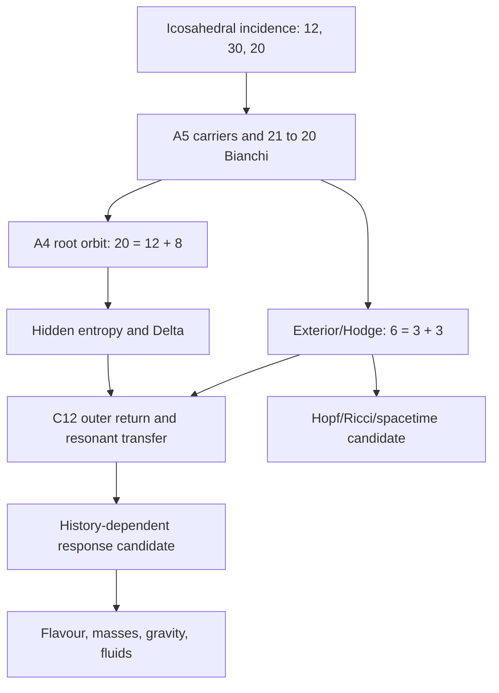

# URT / Newton's Cathedral: revised full three-week reconstruction

**Audit window:** 3–24 August 2026 (Europe/London)  
**Priority window:** 20–24 August 2026  
**Prepared:** 24 August 2026  
**Revision:** 2 — omissions and superseded-status correction

## 1. What this reconstruction does

This is a status-controlled reconstruction of the work completed, attempted, corrected, rejected, or left open during the last three weeks. It covers all 115 dated Library artifacts in the window, the earlier frozen objects actively used during the window, and project work recoverable only from the conversation record. It does not treat a numerical match as a derivation, an explicit construction as a uniqueness theorem, or a later proposal as if it had already been proved in the 22 August master manuscript.

The original `cathedral_master_verifier.py` was rerun successfully. A second verifier, `urt_three_week_gap_verifier.py`, was written and run for the late A4-lattice, resonance/outer-return, entropy, and vortex branches that were not all present in the 22 August master.

### Status key

| Mark | Meaning |
|---|---|
| **E** | Exact finite or algebraic statement; independently checked |
| **N** | Numerical consequence of explicitly stated definitions; recalculated |
| **C** | Conditional theorem/construction: exact after an extra axiom, ansatz, route, or supplied parameter |
| **P** | Physical interpretation or proposed bridge; not derived |
| **F** | Falsified by a direct test or blocked by a no-go result |
| **W** | Withdrawn or superseded; must not be reused as a current result |
| **U** | Unresolved or conversation-only; no recovered executable certificate |

## 1A. Revision notice: what the first reconstruction missed or misstated

The first version of this report was not exhaustive. It preserved the dated file inventory but compressed away large parts of the actual mathematical object. It also repeated a superseded negative operator verdict.

The corrected omissions are:

1. the complete frozen integer/constant set and centred-icosahedral spectrum;
2. the face-normal heat-kernel split and entropy-scale projection;
3. the scalar-residue polynomial giving \(137.035999178195\ldots\);
4. the full hidden Gibbs law and entropy-driven vacuum landmarks;
5. the exact mixed-quartet portal and edge-depth projectors;
6. the Clifford, KO-real, \(\operatorname{Spin}(7)\), and \(14\to8\to3\to0\) stabilizer chain;
7. the conditional three-generation mechanism and the 16/48/96 state construction;
8. the finite-algebra/gauge proposal and the nested-versus-product obstruction;
9. the full \(\operatorname{Hom}(3,3')=4\oplus5\) Yukawa geometry;
10. the corrected interference-preserving matter operator;
11. the fact that the earlier “dressed CKM/PMNS operator fails” verdict is void;
12. the full response mixing, mass-tree, and cosmology ledgers with their conditional status;
13. the hidden-source-to-Ricci isometry, thermodynamic-gravity chain, spectral-gravity candidate, and regular-core black-hole branch;
14. the final bounded-chaos engine, corrected logistic embedding, and tanh separatrix audit;
15. the finite-fluid moments, electromagnetic carrier, Lorentz-force correction, and application side branches.

The operator correction is decisive. For

\[
\widetilde T_{f,e}=A_e+B_f,
\]

the physical positive operator is

\[
K_{f,e}
=A_e^\dagger A_e+B_f^\dagger B_f
+A_e^\dagger B_f+B_f^\dagger A_e.
\]

The retracted calculation omitted the two interference terms, used a covariance-level surrogate, reduced the full \(5\oplus4_3\oplus4_5\) amplitude to one Clebsch block, and assumed rather than derived the passive metric. Consequently its dressed CKM/PMNS values and its negative verdict on the declared operator are void. The exact Hom-space dimensions, Clebsch representatives, rank-depth arithmetic, and local positive-Hessian calculations survive. filecitefile_000000007a0881f495d7319e16039dc9

## 1B. The complete canonical object carried through the window

### Frozen integers and constants

The fixed discrete data are

\[
D=3,\quad V=12,\quad N=13,\quad E=30,\quad F=20,
\quad q=5,\quad |A_5|=60,\quad h=8.
\]

The frozen algebraic constants are

\[
\phi=\frac{1+\sqrt5}{2},\qquad
\gamma=\frac1{81},
\]

\[
d_*=\frac{(1-\gamma)\pi}{N\phi}
=\frac{80\pi}{1053\phi}
=0.14751081015957962\ldots,
\]

\[
d_{\rm cl}=\frac{D}{F}=\frac3{20}=0.15,
\]

\[
\Delta=d_{\rm cl}-d_*
=0.002489189840420375\ldots,
\qquad
\eta_\Delta=-\ln\Delta
=5.995797986741314\ldots.
\]

Here \(d_*\) is a frozen geometric closure postulate. The arithmetic following from it is exact; a unique selection of that postulate from a wider action remains open.

### Centred icosahedral seed, cochains, and representations

The exact finite seed is:

- 13 vertices: 12 shell vertices plus the centre;
- 42 edges: 30 shell edges plus 12 spokes;
- 20 triangular shell faces;
- 60 orientation-preserving \(A_5\) rotations;
- cochain ranks \(\operatorname{rank}d_0=12\) and \(\operatorname{rank}d_1=19\);
- Betti numbers \((1,11,1)\);
- unsigned face-vertex incidence rank 12 and hidden kernel dimension 8.

The centred Laplacian spectrum is

\[
\operatorname{spec}L_{13}
=\left\{
0^{(1)},\,
(6-\sqrt5)^{(3)},\,
7^{(5)},\,
(6+\sqrt5)^{(3)},\,
13^{(1)}
\right\}.
\]

The shell spectrum is

\[
\left\{
0^{(1)},\,
(5-\sqrt5)^{(3)},\,
6^{(5)},\,
(5+\sqrt5)^{(3)}
\right\}.
\]

The permutation carriers decompose as

\[
12=1\oplus3\oplus3'\oplus5,
\]

\[
20=1\oplus3\oplus3'\oplus4\oplus4\oplus5,
\]

\[
30=1\oplus3\oplus3'\oplus4\oplus4
\oplus5\oplus5\oplus5.
\]

The hidden face complement is

\[
H_{\rm hid}=\ker B^\mathsf T
\cong4_3\oplus4_5,
\]

and its dual-face Laplacian is

\[
L_{\rm hid}=3P_3+5P_5.
\]

For the outward face-normal matrix \(N_f\),

\[
N_f^\mathsf TN_f=\frac{20}{3}I_3,
\qquad
L_2N_f=(3-\sqrt5)N_f.
\]

The two golden heat rates are

\[
\lambda_\parallel=3-\sqrt5=\frac{2}{\phi^2},
\qquad
\lambda_\perp=3+\sqrt5=2\phi^2,
\]

with ratio \(\lambda_\perp/\lambda_\parallel=\phi^4\). The reported slow-sector share at the frozen entropy depth is approximately \(99.895\%\). The exact incidence, cochain, Hom-projector, and portal certificates are in the seed audit. filecitefile_00000000e53082109389be8c23dd1faa

### Scalar residue and metric-entropy scaling

With

\[
W_{\rm scalar}=\frac95,\qquad
S_{\rm ent}=\frac{1+\gamma}{D}=\frac{82}{243},
\qquad
S_{\rm exh}=\frac{N-D-1}{qN}=\frac9{65},
\]

the scalar inverse-coupling polynomial is

\[
\alpha_{\rm root}^{-1}
=137+\frac{17572}{1215}\Delta-\frac9{65}\Delta^2,
\]

and therefore

\[
\alpha_{\rm root}^{-1}
=137.035999178195\ldots.
\]

This is **E/N** arithmetic. Its identification with the physical electromagnetic inverse coupling is **C/P** until a common action and charge normalization select the route.

The frozen entropy-to-metric projection is

\[
d\sigma=\frac{N-D}{N}\,d\eta
=\frac{10}{13}\,d\eta,
\qquad
\sigma=\frac{10}{13}\eta,
\]

\[
\frac{\mu}{\mu_C}=e^{-\sigma},
\qquad
\frac{d\alpha_i^{-1}}{d\eta}
=\frac{10}{13}\frac{b_i}{2\pi}.
\]

The recorded landmarks are

\[
\eta_W=d_*,
\qquad
\eta_\Delta=5.995797986741314\ldots,
\]

\[
\eta_{\rm conf}=9.8601129428\ldots,
\qquad
\eta_{\rm IR}=15.6972029190\ldots.
\]

The \(10/13\) projection is a frozen conditional rule; its identification with physical RG running is not derived. filecitefile_00000000dfb8822f8bc426e35389642e

### Exact hidden Gibbs law and entropy-driven vacuum

For

\[
\rho_\eta=\frac{e^{-\eta L_{\rm hid}}}{Z_\eta},
\qquad
Z_\eta=4e^{-3\eta}+4e^{-5\eta},
\]

the frozen probabilities are

\[
p_3=\frac1{1+\Delta^2}
=0.9999938039723294,
\]

\[
p_5=p_{\rm ex}
=\frac{\Delta^2}{1+\Delta^2}
=6.196027670655245\times10^{-6}.
\]

The entropy is

\[
\frac{S_{\rm hid}}{k_B}
=\ln4+H_2(p_{\rm ex})
=1.3863748574272237,
\]

and

\[
\frac{dS_{\rm hid}}{dp_{\rm ex}}
=2k_B\eta_\Delta
=11.991595973482628\,k_B.
\]

The sign convention is fixed:

\[
\delta S_{\rm hid}
=2k_B\eta_\Delta\,\delta p_{\rm ex}.
\]

If the eigenvalue-three probability is used instead, \(p_3=1-p_{\rm ex}\), so its variation carries the opposite sign.

For the explicit 30-edge entropy potential

\[
\mathcal V_\eta(z)
=\frac12z^\mathsf TKz
-\frac1\eta\ln\left(
\frac1{30}\sum_e e^{\eta a_e\cdot z}
\right),
\qquad
K=\operatorname{diag}(I_5,3I_4,5I_4),
\]

the numerical landmarks are:

- coexistence of competing edge vacua near \(\eta=4.778025251274813\);
- isotropic instability at \(\eta=5\);
- orientation bifurcation near \(\eta=7.616838968785596\);
- at \(\eta_\Delta\), \(\mathcal V=-0.07548862041951931\), \(r_5=0.928178049585218\), \(s_{4_3}\simeq0\), \(t_{4_5}=0.17645369560719557\), dominant edge probability about \(0.452692880449\), Hessian minimum about \(0.692812533\), and a 15-element unoriented orbit.

These are verified stationary points of the displayed model, not a proof that this potential is the unique fundamental action. filecitefile_00000000698c81f798e630c72131a31a

### Exterior algebra, edge-depth filtration, and the mixed portal

For the real quartet \(V_4\),

\[
\Lambda^\bullet V_4
=1\oplus4\oplus(3\oplus3')\oplus4\oplus1,
\]

so the old state carrier is organized as

\[
H_{21}=\Lambda^\bullet V_4\oplus5.
\]

The useful exact regrouping is

\[
H_{21}
=(1\oplus3\oplus3')
\oplus(1\oplus5)
\oplus(4\oplus4)
=V_7\oplus M_6\oplus S_8.
\]

The representative generation-depth projectors are

\[
Q_1=\operatorname{diag}(0,0,1),\quad
Q_2=\operatorname{diag}(0,1,0),\quad
Q_3=\operatorname{diag}(1,0,0),
\]

\[
R_\Delta
=Q_1+\Delta Q_2+\Delta^2Q_3
=\operatorname{diag}(\Delta^2,\Delta,1).
\]

The opposite \(C_3\) orientation swaps the second and third depth directions.

The physical triplet and conjugate-triplet portal channels arise only from the mixed product \(4_3\otimes4_5\). The exact squared singular values are

\[
\sigma_\pm^2=\frac{20\pm8\sqrt5}{15},
\]

so

\[
\frac{\sigma_+}{\sigma_-}=\phi^3,
\qquad
\frac{\sigma_+^2}{\sigma_-^2}=\phi^6.
\]

The depth projectors act on the three-dimensional generation triplet, not on a nine-dimensional shadow cone. The diagonal \(4\otimes4\) symmetric terms cannot emit triplets because

\[
\operatorname{Sym}^2(4)=1\oplus4\oplus5.
\]

This removed the earlier claimed Clebsch–Gordan wall. filecitefile_00000000e53082109389be8c23dd1faa

### Golden Hodge operator, fermionic outer lift, and Spin(7)

On the six unoriented icosahedral axes, the signed golden matrix satisfies

\[
S^2=5I_6,
\qquad
H_\phi=\frac{S}{\sqrt5},
\qquad
H_\phi^2=I_6.
\]

The period-six projective cycle cannot lie in \(A_5\), which has no order-six element. Its signed lift obeys

\[
\widehat C H_\phi\widehat C^{-1}=-H_\phi,
\qquad
\widehat C^6=-I_6,
\qquad
\widehat C^{12}=I_6.
\]

The signed \(A_5\) lifts together with \(\widehat C\) generate a group of order 240, with an order-120 quotient and central kernel \(\{\pm I\}\).

The quartet identities

\[
\Lambda^2(4)=3\oplus3',
\qquad
\operatorname{Sym}^2(4)=1\oplus4\oplus5,
\]

\[
\operatorname{End}(4)
=1\oplus3\oplus3'\oplus4\oplus5
\]

produce six \(4\times4\) gamma maps. Clifford closure forces

\[
a=b=2,
\qquad
\delta_{\rm relative}=\frac\pi2,
\]

\[
\gamma_a^\dagger\gamma_b
+\gamma_b^\dagger\gamma_a
=2\delta_{ab}I_4.
\]

Adding the grading gives seven \(8\times8\) gamma matrices whose 21 bivectors close \(\mathfrak{spin}(7)\). The compatible antilinear real structure is unique up to scale and has an eight-real-dimensional fixed subspace, exactly the hidden \(4\oplus4\).

For the actual lifted recursive orbit, the pointwise stabilizers are

\[
14\longrightarrow8\longrightarrow3\longrightarrow0,
\]

with compact Lie algebras

\[
\mathfrak g_2
\longrightarrow\mathfrak{su}(3)
\longrightarrow\mathfrak{su}(2)
\longrightarrow0.
\]

The setwise stabilizer of an oriented two-spinor plane is \(\mathfrak u(3)\). The vector lift has order 12 and the spin lift order 24. The chain was verified for 38 KO-real starting spinors and both one- and two-step recursive orbits.

This is **E** structural closure to numerical linear-algebra precision. Interpreting the three nontrivial returns as three observed matter generations is **C/P** because it additionally assumes that generations are recursive spinor flags and that retained continuous stabilizer is the physical selection criterion. filecitefile_00000000ea3481f48590666836d36e78

### KO-6 seed, matter counts, and gauge-product obstruction

The hidden spectral-triple seed is organized with

\[
H_{\rm sh}=H_3\oplus H_5,
\qquad
\Gamma_F=\operatorname{diag}(-I_4,+I_4),
\]

\[
J_{\rm lin}
=\begin{pmatrix}0&-U^\mathsf T\\ U&0\end{pmatrix},
\qquad
\mathcal J_F=C_FK,
\qquad
D_{\rm sh}=iJ_{\rm lin}.
\]

This realizes the declared KO-dimension-six sign pattern once the chosen intertwiner \(U\), grading, and conjugation are supplied.

Under the \(SU(3)\) stabilizer,

\[
\Delta_8^{\mathbb C}
=1\oplus1\oplus3\oplus\overline3.
\]

With the proposed chiral dictionary

\[
\Delta_L=1\oplus3,
\qquad
\Delta_R=1\oplus\overline3,
\]

and a right-handed neutrino, the Standard-Model-style count is 16 complex particle states per generation, 48 for three generations, and 96 after conjugates.

The representation decompositions are exact. The identification with quarks, leptons, weak chirality, and physical generations is conditional.

The natural finite-algebra candidate is

\[
\mathcal A_F
=\mathbb C\oplus\mathbb H\oplus M_3(\mathbb C),
\]

suggesting

\[
\mathfrak u(1)\oplus\mathfrak{su}(2)
\oplus\mathfrak{su}(3)
\]

and, after unimodularity, the familiar global quotient candidate. But the recursive stabilizer chain is nested,

\[
\mathfrak g_2\supset\mathfrak{su}(3)
\supset\mathfrak{su}(2),
\]

whereas the Standard Model algebra is a commuting direct sum. The actual commutants, cross-brackets, representations, global quotient, and 48-state action still have to be derived. The finite algebra is natural but not uniquely forced.

### Conditional hypercharge and the two weak-angle slots

Assuming Standard-Model multiplets, one Higgs of hypercharge \(h\), Yukawa invariance, a neutral right-handed neutrino, and anomaly cancellation gives

\[
(q,u,d,\ell,e,n)
=\frac16(1,4,-2,-3,-6,0)
\]

after choosing \(h=1/2\). All remaining gauge and cubic anomalies cancel exactly.

The bare quadratic trace factors are

\[
k_Y=\frac{10}{3},\qquad k_2=k_3=2,
\]

and hence

\[
k_Y:k_2:k_3=\frac53:1:1,
\qquad
\sin^2\theta_W\big|_{\rm bare}=\frac38.
\]

The separate low-energy response assignment is

\[
\sin^2\theta_W\big|_{\rm response}=\frac3{13}.
\]

These are different quantities. A common action must derive the matching scale, running, thresholds, and normalization. The anomaly result is exact conditional arithmetic; the physical gauge derivation remains incomplete. filecitefile_00000000698c81f798e630c72131a31a

### Full Hom(3,3') Yukawa geometry

The exact transfer carrier is

\[
\operatorname{Hom}_{A_5}(3,3')=4\oplus5.
\]

For the 15 unoriented edge-fiveplet directions \(X_a\),

\[
\frac1{15}\sum_a X_a\otimes X_a=\frac15I_5,
\]

and their inner products are

\[
1,\qquad \frac14\ \text{for eight neighbours},\qquad
-\frac12\ \text{for six neighbours}.
\]

The 60 nearest-neighbour pairs split into two 30-element classes whose count/weight relation is governed by \(\phi^2\).

The fivefold Hodge coefficients are

\[
c_{72}
=\sqrt{\frac{5-2\sqrt5}{3}},
\qquad
c_{144}
=\sqrt{\frac{5+2\sqrt5}{3}},
\]

\[
\frac{c_{144}}{c_{72}}=\phi^3.
\]

A fiveplet-only map has rank two; a quartet-only map also has rank two. The complex quadrature

\[
T=M_5+iM_4
\]

has rank three. At the audited selector maximum,

\[
\sigma(T)\approx
(1.22425545,\ 0.67219435,\ 0.22215614),
\]

\[
\frac{\sigma_1}{\sigma_2}\approx1.821282,\quad
\frac{\sigma_1}{\sigma_3}\approx5.510788,\quad
\frac{\sigma_2}{\sigma_3}\approx3.025774,
\]

\[
\|T\|_F^2=2,\qquad
|\det T|\approx0.182821.
\]

The selector gives one \(A_5\)-invariant Yukawa shape, but not the Standard Model hierarchy. The missing object is the species/history-dependent orientation \(\Omega_f\).

### Correct finite matter operator and surviving flavour no-go theorems

The declared full operator is

\[
\widetilde T_{f,e}
=C_5(H_e)
+C_{4_3}\left(\Xi_{3e}+\frac{Jq_f}{3}\right)
+iC_{4_5}\left(\Xi_{5e}
+\frac{J\Delta g(q_f)}5\right).
\]

It must be squared with every cross term retained and compared with the passive operator derived from the same history state:

\[
R_{f,e}
=K_{0,f}^{-1/2}K_{f,e}K_{0,f}^{-1/2}.
\]

The earlier dressed verdict is withdrawn; the complete operator has not yet been globally solved and blind-certified.

What is genuinely ruled out is:

1. **A4 covariance alone:**  
   \[
   \dim_{\mathbb R}
   \operatorname{Hom}_{A_4}(H_R,H_L)=48,
   \]
   so it does not select one Dirac operator.

2. **Natural first-order A4 Clifford connection:**  
   \[
   K_u=K_d=K_e=K_\nu
   =\frac{|z_\ell|^2+3|z_c|^2}{3}I_3,
   \]
   so it is generation- and species-degenerate.

3. **Separate spectral actions:** four nondegenerate species carry a 16-real-dimensional relative-flag space invisible to sums of individual spectral functions.

4. **Untyped one-sheet ribbons:** the Clebsch maps live in \(\operatorname{Hom}(3,3')\), not \(\operatorname{End}(3)\); the correct lift requires both sheets.

5. **Blind real Wilson–KL history:** it gives wrong mixing and is chirality-degenerate, flipping the sign of \(J\) while preserving absolute mixing and free energy.

The oriented species plane contains both

\[
g_{fg}=q_f\cdot q_g,
\qquad
\omega_{fg}=n\cdot(q_f\times q_g),
\]

and the Hermitian pairing

\[
h_{fg}=g_{fg}+i\omega_{fg}
\]

has rank one and obeys the anomaly-weighted closure

\[
3z_u+3z_d+z_e+z_\nu=0.
\]

Dropping \(\omega\) discards the only canonical species orientation. The missing flavour ingredient is therefore an oriented, noncommuting, history-sensitive connection. filecitefile_00000000a0bc81f4be8cef793fe19486

### Response-layer mixing, mass, and cosmology ledgers

After integrating out the passive path variables, the response model uses

\[
\Gamma[x]
=\frac\kappa2(x-x_0)^2-J(x-x_0),
\qquad
x_*=x_0+\frac J\kappa,
\]

and for a positive radial mode,

\[
\Gamma_{\rm rad}[r]
=\frac\kappa2r^2-\ln r,
\qquad
r_*=\frac1{\sqrt\kappa}.
\]

Applied to the frozen counts, the quark assignments are

\[
s_{12}^Q=\frac1{\sqrt{20-1/8}}
=0.22430886163681774,
\]

\[
s_{23}^Q=\Delta(\phi^6-1)
=0.04217750949169026,
\]

\[
s_{13}^Q=\frac32\Delta
=0.0037337847606305624,
\]

\[
J_Q=\gamma\Delta
\left(1+\frac95\gamma\right)
=3.1413644076635733\times10^{-5}.
\]

The lepton assignments are

\[
\sin^2\theta_{12}^L
=\frac13-12\Delta
=0.3034630552482888,
\]

\[
\sin^2\theta_{23}^L
=\frac12+20\Delta+\gamma
=0.5621294758207531,
\]

\[
\sin^2\theta_{13}^L
=2\gamma
\left(\frac{d_*}{d_{\rm cl}}\right)^2
(1-20\Delta)
=0.02268990026713027,
\]

\[
J_L=-13\Delta
=-0.032359467925464874.
\]

These are exact outputs of the displayed **response-routing model**. They are not CKM/PMNS eigenvectors of the unresolved full interference-preserving Dirac operator.

The recursive mass tree uses the top mass as an external unit and assigns, among other routes,

\[
\frac{m_b}{m_t}=2q\Delta,\qquad
\frac{m_\tau}{m_t}=4\Delta,\qquad
\frac{m_c}{m_t}=3\Delta,
\]

\[
\frac{m_s}{m_t}
=(2q\Delta)(3D\Delta),\qquad
\frac{m_u}{m_t}=2\Delta^2,
\]

with longer serial routes for \(m_\mu,m_d,m_e\). The proposed neutrino tree is

\[
\frac{m_3}{m_t}=D\Delta^q
=2.866892136839058\times10^{-13},
\]

\[
\frac{m_2}{m_3}=\sqrt{V\Delta}
=0.1728302001533427,
\]

\[
\frac{m_1}{m_3}=D\Delta^3
=4.626955407371302\times10^{-8}.
\]

This is reproducible route arithmetic; it does not yet supply finite-Dirac eigenvalues or an internally derived mass scale.

The response cosmology ledger includes

\[
\Theta_{\rm QCD}
=\left(\frac{J_Q}{\pi}\right)^2
=9.998546994088552\times10^{-11},
\]

\[
\eta_B=6\Theta_{\rm QCD}
=5.999128196453131\times10^{-10},
\]

\[
A_s=21\Theta_{\rm QCD}
=2.099694868758596\times10^{-9},
\]

\[
\Omega_m=\frac6{19},\qquad
\Omega_\Lambda=\frac{13}{19},
\]

\[
\Omega_b=\frac6{19}\frac2{13},
\qquad
\Omega_c=\frac6{19}\frac{11}{13},
\qquad
\frac{\Omega_c}{\Omega_b}=\frac{11}{2},
\]

\[
n_s=1-3\gamma+\Delta
=0.9654521528033834,
\]

\[
\alpha_s=-\Delta^2
=-6.196066061652012\times10^{-6},
\]

\[
r=16\gamma\Delta
=0.0004916918203299506,
\qquad
n_t=-\frac r8.
\]

These assignments do not derive Friedmann evolution, inflation, baryogenesis, dark-matter dynamics, recombination, or a likelihood. Their status is **C**, not observational closure. filecitefile_0000000031c081f49360cd0338824aeb

### Higgs trace and normalization obstruction

The recovered trace polynomials give

\[
a_Y
=\frac{16(100+183\Delta^2)}{75}
=21.33357522775238,
\]

\[
b_Y
=36.34206561805763,
\qquad
\frac{b_Y}{a_Y^2}
=0.07985136067642659.
\]

For

\[
\frac{\lambda_H}{g_2^2}
=C_{\rm norm}\frac{b_Y}{a_Y^2},
\]

the formerly claimed target

\[
\lambda_{H,\rm target}
=\frac18+\frac\gamma3
=0.12911522633744857
\]

requires

\[
C_{\rm norm}=4.069095184887046.
\]

The simple choice \(C_{\rm norm}=4\) gives

\[
\lambda_H=0.12692278796229012,
\]

about \(1.69805\%\) low. Therefore the physical Higgs closure is not exact; a common gauge/Higgs trace convention must derive the normalization.

### Hidden source, Ricci map, and gravity branches

Identify the two hidden quartets with the same real four-space and set

\[
x=\Xi_3,\qquad
y=*^{-1}\Xi_5,\qquad
z=\sqrt3\,x+i\sqrt5\,y.
\]

Then

\[
\operatorname{Re}(zz^\dagger)
=3xx^\mathsf T+5yy^\mathsf T,
\]

and

\[
\Sigma
=\left[3xx^\mathsf T+5yy^\mathsf T\right]_0
\in\operatorname{Sym}^2_0(V_4)
=4\oplus5.
\]

The standard four-dimensional curvature-operator decomposition puts traceless Ricci in

\[
\operatorname{Hom}(\Lambda^2_+,\Lambda^2_-)
=4\oplus5.
\]

For the constructed Kulkarni–Nomizu map, every singular value of

\[
\Sigma\longmapsto B_\Sigma
\]

is \(1/2\). Thus

\[
2B:
\operatorname{Sym}^2_0(V_4)
\longrightarrow
\operatorname{Hom}(\Lambda^2_+,\Lambda^2_-)
\]

is an isometric isomorphism. This establishes the exact carrier and normalization of the finite traceless-Ricci map. It does not yet identify \(\Sigma\) with physical stress-energy.

For trace-preserving hidden-density perturbations,

\[
T_C
=3J_3\delta\rho_{33}J_3^\mathsf T
+5J_5\delta\rho_{55}J_5^\mathsf T,
\]

\[
\delta S_{\rm hid}
=k_B\eta\,\operatorname{Tr}(T_C).
\]

The trace is the scalar entropy response and the traceless part occupies the Ricci carrier. For null \(k^a\), a metric-proportional ambiguity drops out because \(g_{ab}k^ak^b=0\).

The thermodynamic Einstein chain is conditional on local Rindler horizons, Unruh temperature, local equilibrium, Raychaudhuri focusing, area entropy, a conserved physical stress tensor, and a physical area-per-cell map. The missing normalization can be written as

\[
2k_B\eta_\Delta
\frac{dp_{\rm ex}}{dA}
=\frac{k_B}{4\ell_*^2},
\qquad
\ell_*^2=G\hbar.
\]

The finite seed does not yet determine \(dp_{\rm ex}/dA\), \(\ell_*\), energy per cell, or the continuum gluing.

For the chosen exponential spectral kernel,

\[
\frac{G\Lambda_{\rm cut}^2}{g_U^2}
=\frac{\eta_\Delta}{16\pi}
=0.1192826109212893.
\]

This fixes only a dimensionless combination within that candidate.

Two proposed gravitational response formulas give

\[
\alpha_G^{(1)}
=1.7517515687787907\times10^{-45},
\]

\[
\alpha_G^{(2)}
=1.7518093166537004\times10^{-45},
\]

differing relatively by about \(3.29658\times10^{-5}\). Neither is selected uniquely, so neither derives Newton's constant.

The finite eigenvalue-seven fiveplet projector has zero central response and is not a positive radial \(1/r\) Green function.

The separate regular-core black-hole ansatz

\[
f(r)
=1-\frac{r_sr^2}{(r^2+a^2)^{3/2}},
\qquad
a=d_*r_s,
\]

has a finite de Sitter-type core and exact Einstein tensor. For the frozen \(d_*\), the dimensionless horizon radii are

\[
\frac{r_-}{r_s}=0.06462981756549308,
\qquad
\frac{r_+}{r_s}=0.9660164266449951.
\]

This is exact for the chosen metric ansatz; selection of that metric and its source from the common URT action is unproved. filecitefile_00000000698c81f798e630c72131a31a

### Final bounded-chaos engine, logistic rail, and tanh audit

The final constructed complex engine is

\[
Z_{n+1}=\left[
\frac\pi e
-\left(\frac\pi e-1\right)
\left(\frac{|Z_n|}{9/13}\right)^4
\right]
\frac{Z_n^2}{|Z_n|}
e^{i\pi(3-\sqrt5)}.
\]

It has the exact invariant circle

\[
|Z|=\frac9{13}.
\]

On that circle,

\[
\lambda_+=\ln2
=0.6931471805599453,
\]

\[
m_r=5-\frac{4\pi}{e}
=0.3770906008363131,
\]

\[
\lambda_-=\ln|m_r|
=-0.9752697998857527,
\]

\[
\lambda_++\lambda_-
=-0.2821226193258074<0.
\]

Thus the displayed map has one chaotic expanding direction and net dissipation. The map is constructed, not uniquely derived from the Cathedral event action.

The logistic embedding that pins the current rail uses

\[
r_*=3.84167378699470935954
\]

and produces a stable six-cycle beginning at \(d_*\). Because \(r_*\) is chosen so that the cycle contains the already-fixed rail, this is an embedding, not an independent selection theorem.

The older archived rail used

\[
d_{\rm old}=0.1474219361623,
\qquad
r_{\rm old}=3.8417002878419497,
\]

which differs from the frozen geometric \(d_*\) by approximately \(8.8874\times10^{-5}\).

For the audited tanh operator

\[
T_\delta(x)
=\left[x-\delta\tanh(x/\delta)\right]
\left[1+\pi\phi\delta^2\right],
\]

\(x=0\) is superstable, while the nonzero fixed points are unstable separatrices. It provides a collapse/runaway boundary in state amplitude; it does not select the two rail parameters. Target-free sweeps and refinements toward \(0.15\) do not establish that generic chaos discovers the rail.

### Vortex/PLCT and resonant outer return

The exact mod-9 doubling dynamics is

\[
\mathbb Z_9
=\{0\}\sqcup\{3,6\}
\sqcup\{1,2,4,8,7,5\},
\]

with \(2^{-1}=5\pmod9\) and square subgroup \(\{1,4,7\}\). For \(2^a3^b\), the unit layer is the six-cycle, the \(b=1\) layer alternates \(3,6\), and \(b\ge2\) collapses to zero. Mersenne residues inherit a shifted version of this cycle, but no primality theorem follows.

For

\[
L_\phi=5I-S,\qquad
F_\epsilon=e^{-\epsilon L_\phi}C,
\qquad
\epsilon=-\frac{\ln\Delta}{30},
\]

the late verifier proves

\[
F_\epsilon^6=-\Delta I_6,
\qquad
F_\epsilon^{12}=\Delta^2I_6.
\]

Each three-dimensional Hodge sector has two-step determinant magnitude \(\Delta\); the full six-dimensional determinant is \(\Delta^2\).

The eigenvalues \(5\pm\sqrt5\) obey

\[
\sqrt{\frac{5+\sqrt5}{5-\sqrt5}}=\phi,
\]

which is a frequency ratio under an equal-mass harmonic interpretation.

The detuning

\[
T_{\rm geo}=\ln2-\frac9{13}
=0.000839488252252996\ldots
\]

and

\[
f_{\rm res}
=\frac{T_{\rm geo}}{\ln2}
=0.00121112553840994\ldots
\]

are exact arithmetic between defined dimensionless quantities. Calling them a physical loss fraction requires a derived coupling.

### Electromagnetic, fluid, and application branches

The exterior/Hodge structure supplies correctly typed scalar, one-form, bivector, and dual-form carriers, but Maxwell dynamics, charge normalization, a propagating photon, and the Lorentz force are not all derived from one action.

A purely dissipative scalar gradient cannot generate magnetic deflection because

\[
v\cdot(v\times B)=0.
\]

The structurally correct candidate is an antisymmetric/Hamiltonian response such as

\[
F=q\,*(\iota_vd\theta_2)=q\,v\times B^*,
\]

after the physical two-form and skew mobility are supplied.

The 12 directions plus rest state with

\[
w_0=\frac25,\qquad
w_a=\frac1{20}
\]

give exact second-, third-, and fourth-order isotropic moments:

\[
\sum_aw_au_a^iu_a^j=\frac15\delta^{ij},
\]

\[
\sum_aw_au_a^iu_a^ju_a^k=0,
\]

\[
\sum_aw_au_a^iu_a^ju_a^ku_a^\ell
=\frac1{25}
(\delta^{ij}\delta^{k\ell}
+\delta^{ik}\delta^{j\ell}
+\delta^{i\ell}\delta^{jk}).
\]

With an added BGK law and Chapman–Enskog limit,

\[
c_s^2=\frac{c^2}{5},
\qquad
p=\frac{\rho c^2}{5},
\qquad
\nu=\frac{c^2\tau}{5}.
\]

The moments are exact; Navier–Stokes and global regularity are not derived.

The North Star results remain reduced-model engineering outputs, not experiments. The corrected small-cone model requires about \(3.56\) GW auxiliary power at \(100\,\mu{\rm s}\) confinement but about \(124.49\) kW at one second. The larger optimized model reports \(Q\approx3.16\), while the vortex-only candidate is extremely sensitive to assumed Bohm transport.

The EEG/seizure-prediction branch was raised for retesting against earlier URT baselines, but no new recoverable dataset run or executable certificate appears in the evidence set. Any claimed successful retest not backed by such an artifact must be treated as withdrawn/hallucinated, not imported into the theory ledger.

The music branch remained a structural analogy between phase locking, harmonic ratios, scale recursion, and URT resonance. No actual audio analysis was performed. Likewise, the Maxwell-image and public infographic discussions were interpretive prompts, not new proof certificates.

## 2. Decisive conclusion

The three weeks produced a substantial and increasingly coherent **finite mathematical architecture**: centred-icosahedral incidence and spectra; \(A_5\) representation theory; the hidden \(4\oplus4\) entropy sector; the \(21\to20\) Bianchi reduction; the A4/A5 \(20=12+8\) bridge; exterior/Hodge structure; the 240-element fermionic outer cover; forced Clifford quadrature and \(\operatorname{Spin}(7)\); the \(14\to8\to3\to0\) recursive stabilizer flag; the exact mixed portal; the normalized traceless-Ricci carrier; bounded chaotic dynamics; and exact mod-9 vortex arithmetic. Those pieces genuinely interlock.

They did **not** yet produce a completed or uniquely selected theory of nature. The missing step is not another attractive numerical coincidence. It is a derived, unique dynamical and observational map from the finite/history-dependent structure to global spacetime, a commuting gauge product, the complete interference-preserving finite Dirac operator, masses/mixing, physical gravity normalization, Born probabilities, and continuum field dynamics. Several simpler observable maps were directly falsified, the full matter operator remains open rather than falsified, and unrestricted control was proved capable of realizing an arbitrary recurrence. Therefore the current honest status is:

> **A mathematically nontrivial candidate architecture with exact finite cores, but not yet a derivation of our universe.**

The late A4 and resonance work, together with the earlier Spin(7), portal, entropy, and Ricci closures, makes the architecture much stronger than the first version of this report stated. It still does not remove the listed physical-selection obligations.

## 3. The last five days, reconstructed first

## 20 August — oriented chiral branch and the first resonant return

### 20.1 Oriented chiral vacuum

The oriented-chiral construction fixed its coefficients before inspecting the desired flavour outcome. The finite optimization then gave:

Source: filecitefile_00000000036c82439fb08971b4a983ef

- **E:** stationarity residual approximately `3.849e-15`;
- **E:** minimum Hessian eigenvalue approximately `0.9255858`, so the reported stationary point is locally stable for the defined functional;
- **E:** vacuum orbit size `30`;
- **E:** the charge word/operator is an explicit polynomial in the stated finite operators;
- **N:** the selected branch-15 action is approximately `111.886875`.

These are real certificates of the **defined finite variational problem**. They do not by themselves identify the physical fermion operator.

### 20.2 Reduced-operator test and controlling erratum

The oriented audit formed quark and lepton mixing matrices from a reduced charge block and obtained values far from observation. That numerical statement is true for the reduced model actually evaluated, but the later operator audit shows that it was not the declared full finite matter operator.

- **E/N:** the stored reduced calculation gives the reported wrong CKM/PMNS values.
- **W/VOID:** it cannot establish that the declared full operator fails, because it omitted the interference terms, reduced the (5\oplus4_3\oplus4_5) amplitude sum, and lacked the derived passive relative operator.
- **F:** selecting a branch because it lies closer to observation would still be target-based fitting.
- **U:** the complete interference-preserving operator remains unsolved and unblind-tested.

The exact vacuum stationarity and positive Hessian survive. The earlier dressed CKM/PMNS values and negative physical verdict do not. filecitefile_000000007a0881f495d7319e16039dc9

### 20.3 Resonant outer-return operator

The late resonance branch introduced

\[
d_*=\frac{(1-1/81)\pi}{13\phi},\qquad
\Delta=\frac{3}{20}-d_*,\qquad
L_\phi=5I-S,
\]

with an outer operator $C$ satisfying

\[
C L_\phi C^{-1}=10I-L_\phi,
\qquad C^6=-I,
\qquad C^{12}=I.
\]

For

\[
F_\epsilon=e^{-\epsilon L_\phi}C,
\qquad
\epsilon=-\frac{\ln\Delta}{30}
=0.199859932891377\ldots,
\]

the gap verifier proves:

\[
F_\epsilon^2=e^{-10\epsilon}C^2,
\qquad
F_\epsilon^6=-\Delta I_6,
\qquad
F_\epsilon^{12}=\Delta^2 I_6.
\]

Status:

- **E:** all matrix identities above;
- **E:** each three-dimensional Hodge sector has $|\det(F_\epsilon^2)|=\Delta$;
- **E:** the full six-dimensional determinant is $|\det(F_\epsilon^2)|=\Delta^2$, not $\Delta$;
- **C/P:** reading `1, Delta, Delta^2` as three generations is a proposed physical selection rule;
- **C:** epsilon is fixed only after the already-defined Delta is supplied, so the transfer operator unifies two structures but does not independently derive Delta.

The determinant distinction is important: an earlier broad statement that the whole six-dimensional two-step determinant equals Delta was too strong. Delta is the determinant magnitude on either three-dimensional Hodge block; the full determinant is Delta squared.

## 21 August — blind-history no-go, conditional response closure, vortex/PLCT, and minimal completion

### 21.1 Correctly typed blind-history completion

The representation typing was corrected. Since

\[
\operatorname{Hom}_{A_5}(3,3')\cong 4\oplus5,
\]

the relevant lift is six-dimensional rather than an ad hoc three-dimensional shortcut. The jointly typed Wilson/KL construction was then tested blind.

- **E:** the six-dimensional Galois/history lift is the correct finite carrier for the defined test.
- **F:** its Wilson-KL output gives the wrong CKM and PMNS matrices.
- **F:** a real Wilson free energy is chirality-degenerate: conjugate histories have equal free energy and equal absolute mixing entries, while the Jarlskog invariant changes sign.
- **F:** therefore that real free-energy principle cannot select the observed sign of CP violation.

This is one of the strongest results of the final week because it rules out a specific seemingly natural completion after correcting the representation type.

Source: filecitefile_0000000027e08243b8e9b5482db9361c

### 21.2 Response closure and response-layer routing

The response report then applied a common response rule across flavour observables. It generated several values close to the desired phenomenology.

- **N:** the reported arithmetic follows from the stated response equations and route assignments.
- **C:** the result is a theorem of the **response-routing axiom**, not a derivation of that axiom.
- **U/P:** the finite action does not uniquely select which observable receives which route, depth, sign, or normalization.

The 22 August master correctly downgraded these values to conditional response arithmetic. They must not be described as parameter-free flavour predictions.

Sources: filecitefile_0000000031c081f49360cd0338824aeb filecitefile_00000000698c81f798e630c72131a31a

### 21.3 Minimal completion package

The `minimal_response_theorem`, `urt_minimal_completion`, and response-layer files propagated the same finite constants into:

- flavour and mass ratios;
- cosmological quantities;
- gravitational formulas;
- Higgs-sector values;
- mixing and response quantities.

The calculations are reproducible, but their status is uniform:

- **N:** arithmetic consequences of explicit route formulas;
- **C:** valid if the route/normalization/dynamical ansatz is assumed;
- **not E:** they are not unique Dirac, Friedmann, Einstein, or Standard-Model dynamics derived from the finite action.

### 21.4 Vortex / PLCT modular arithmetic

The modular branch used

\[
T(x)=2x\pmod 9.
\]

The exact partition is

\[
\mathbb Z_9=\{0\}\sqcup\{3,6\}\sqcup\{1,2,4,8,7,5\}.
\]

Further exact results:

- **E:** the units form a cyclic six-cycle under doubling;
- **E:** $2^{-1}=5\pmod 9$;
- **E:** the square subgroup is $\{1,4,7\}$;
- **E:** for $2^a3^b$, `b=0` remains on the unit hexagon, `b=1` alternates between 3 and 6, and `b>=2` maps to 0;
- **E:** Mersenne residues $2^p-1\pmod 9$ follow the shifted doubling cycle;
- **F:** residue cycling does not imply a theorem about Mersenne primality.

This branch is exact number theory. The interpretation of the six-cycle as a physical vortex/phase-lock primitive is **P** until a dynamical map is derived.

### 21.5 600-cell / binary-icosahedral relation

- **E:** the 120 vertices of the 600-cell realize the binary icosahedral group $2I\subset SU(2)$;
- **E:** $2I/\{\pm1\}\cong A_5$;
- **P:** identifying that finite SU(2) object with the Hopf fibre used by the physical spacetime construction is a structural bridge, not yet an identity theorem.

### 21.6 Outer/Hodge and Lorentz-related work

For the recovered outer operator $\widehat C$:

\[
\widehat C^6=-I,
\quad \widehat C^{12}=I,
\quad J=\widehat C^3,
\quad J^2=-I.
\]

The wedge pairing on the six-dimensional two-form space has signature `(3,3)`.

- **E:** the finite order, complex structure, and split wedge signature;
- **C:** a conformal Lorentz Hodge star follows once the appropriate four-dimensional oriented conformal structure is supplied;
- **U/P:** universal Fisher stiffness, a global spacetime isometry, and a uniquely selected phase $\theta=\pm\pi/3$ were discussed but have no recovered executable certificate.

### 21.7 180-state fermion/history branch

A 180-state discussion produced approximate sector weights

\[
(0.4585,\ 0.4413,\ 0.1002)
\]

and replaced an older Dirac ansatz with a path-generating functional plus an entropy-regularized vacuum/Hessian proposal.

- **W:** the old Dirac ansatz was rejected.
- **U/P:** the 180-state weighting and path functional remain conversation-only in this audit; no dated certificate was recovered.

## 22 August — master integration plus the omitted A4 lattice branch

### 22.1 What the master manuscript actually established

The 2,243-line master and its 1,083-line verifier integrated the strongest finite results and explicitly retained many no-go results. The rerun confirms the following.

Sources: filecitefile_00000000698c81f798e630c72131a31a filecitefile_000000007bc081f7ac56d510d251dbb8

#### Icosahedral incidence and hidden entropy

- **E:** 12 vertices, 30 shell edges, 20 faces; the centered construction carries 42 edge objects.
- **E:** centered operator spectrum
  
  `0^1, 3.763932^3, 7^5, 8.236068^3, 13^1`.
- **E:** shell spectrum
  
  `0^1, 2.763932^3, 6^5, 7.236068^3`.
- **E:** face-incidence rank `12`, hidden kernel dimension `8`.
- **E:** hidden spectrum `3^4 + 5^4`.
- **E:** reported Betti numbers `(1,11,1)` for the defined finite complex.
- **N:**
  
  \[
  p_3=0.9999938039723294,
  \quad p_5=6.196027670655223\times10^{-6},
  \]
  
  \[
  S_{\rm hidden}/k_B=1.3863748574272237,
  \quad
  \frac{1}{k_B}\frac{dS}{dp_{\rm exhaust}}
  =11.9915959734826.
  \]
- **E/N:** the sign error in the earlier entropy derivative was corrected.

#### A5 modules and Bianchi typing

- **E:**
  
  \[
  H_{21}=2\cdot1\oplus3\oplus3'\oplus2\cdot4\oplus5.
  \]
- **E:** the pre-Bianchi curvature carrier is
  
  \[
  2\cdot1\oplus4\oplus3\cdot5,
  \]
  
  so it is **not** the same module as $H_{21}$.
- **E:** after the Bianchi constraint, the curvature carrier is
  
  \[
  1\oplus4\oplus3\cdot5,
  \]
  
  giving the exact `21 -> 20` reduction.
- **E:**
  
  \[
  \operatorname{Hom}(3,3')\cong4\oplus5.
  \]

#### Exterior/Hodge/Ricci structure

- **E:** the six two-form axes carry a split `(3,3)` wedge form.
- **E:** the traceless Ricci-domain module $\mathrm{Sym}^2_0(\mathbb R^4)$ and $\operatorname{Hom}(\Lambda^2_+,\Lambda^2_-)$ both type as `4+5`.
- **E:** every singular value of the tested Ricci map is `1/2`, so twice the map is an isometry of the typed finite spaces.
- **P:** identifying that finite map with physical stress-energy and fixing its dimensional normalization remain open.

#### Hopf and spacetime

- **E:**
  
  \[
  S^7/SU(2)=S^4,
  \]
  
  with local quotient dimension four.
- **P:** this does not by itself supply global Lorentzian spacetime, causal structure, a physical clock, or an Einstein action.

#### Hypercharge, gauge, spin-2, fluids, Born, and black-hole sectors

- **C:** the reported hypercharge relations and bare $\sin^2\theta_W=3/8$ are exact once the Standard-Model multiplet content and normalization assumptions are supplied.
- **E/F:** the tested spin-2 projector has rank five and zero central response; it does not produce a Newtonian $1/r$ potential.
- **C:** black-hole formulas are exact consequences of their chosen metric/thermodynamic ansatz, not a derived metric.
- **E:** the stated low-order discrete-fluid moments are exact.
- **C:** Navier-Stokes needs the additional BGK/Chapman-Enskog scaling and continuum limit.
- **C:** Born probabilities follow after a probability/amplitude interpretation is assumed; that interpretation is not selected by the finite geometry.

#### Recursive engine and contraction

For the constructed engine:

\[
r_*=\frac9{13},
\qquad
\theta=\frac{2\pi}{\phi^2},
\]

with Lyapunov exponents

\[
\lambda_+=\ln2=0.6931471805599453,
\quad
\lambda_-=-0.9752697998857527,
\]

and sum

\[
\lambda_++\lambda_-=-0.2821226193258074.
\]

- **E/N:** those values follow from the defined map.
- **C:** the map is constructed; uniqueness from the Cathedral action was not proved.
- **F:** the earlier global contraction claim is false as stated. The constant $\kappa=0.922845\ldots$ is valid only on an invariant bounded domain such as $|P|\le\pi$, or after a globally Lipschitz replacement is specified.

#### Normalization and gravity corrections

- **E/N:** the portal factor is $\phi^3=4.236\ldots$ for amplitudes and $\phi^6=17.944\ldots$ for squared amplitudes; these must not be interchanged.
- **F:** the tested Higgs normalization does not yield the formerly advertised value. The target `0.129115` would require `C_norm=4.069095...`; `C_norm=4` gives `0.126922788...`, about `1.698%` low.
- **F:** two proposed gravity formulas differ by approximately `3.2966e-5` relative and neither derives Newton's constant.
- **C:** the information-free-energy functional is exact after a prior and response kernel $K$ are supplied; physical $K$ is not uniquely derived.

### 22.2 A4 lattice branch — exact result and necessary correction

The late branch proposed

\[
A_4=\{n\in\mathbb Z^5:\sum_i n_i=0\}
\]

and connected its 20 roots with the 20 oriented icosahedral faces.

The gap verifier sharpens the statement:

- **E:** $A_4$ has 20 normalized roots $(e_i-e_j)/\sqrt2$, spanning a four-dimensional space.
- **E:** the alternating group $A_5$ acts transitively on those roots, with stabilizer $C_3$; hence the root set is the homogeneous $A_5$-set $A_5/C_3$.
- **E:** the 20 oriented icosahedral faces are also $A_5/C_3$.
- **E:** therefore the roots and faces are exactly isomorphic as $A_5$-sets and as 20-dimensional permutation modules.
- **E:** the root permutation representation decomposes as
  
  \[
  20=1\oplus3\oplus3'\oplus2\cdot4\oplus5.
  \]
- **E:** the 12-dimensional visible icosahedral shell is
  
  \[
  12=1\oplus3\oplus3'\oplus5,
  \]
  
  and the hidden difference is exactly
  
  \[
  8=4\oplus4.
  \]
- **E:** this proves the representation identity
  
  \[
  20=12+8.
  \]
- **E:** the Cartan determinant is `5`, and $A_4^*/A_4\cong\mathbb Z_5$.
- **F/correction:** the 20 roots are **not** the same Euclidean point shell as the 20 face centres. The roots span dimension four and have inner products `-1,-1/2,0,1/2,1`; face centres span dimension three and have a different Gram spectrum.
- **C/P:**
  
  \[
  g=P-2tt^T
  \]
  
  has Lorentz signature `(-,+,+,+)` when $P$ is a positive four-dimensional projector and $t$ is a supplied unit vector. The algebraic signature is exact; entropy selection of $t$, lattice spacing, and physical causal meaning are not yet derived.

This is the most important correction to the late A4 claim: **the bridge is exact equivariantly, not metrically**.

## 23 August — resonance integration resumed; no new chiral certificate

The 20 August oriented-chiral report was uploaded again under a duplicate filename. Its content and status did not change.

The resonance discussion then added:

\[
T_{\rm geo}=\ln2-\frac9{13}
=0.000839488252252996\ldots,
\qquad
f_{\rm res}=\frac{T_{\rm geo}}{\ln2}
=0.00121112553840994\ldots.
\]

- **N:** these are exact numerical differences/ratios between already-defined dimensionless quantities.
- **P:** calling them a physical loss, detuning, or resonance fraction requires a derived coupling.

For the two shell eigenvalues

\[
\lambda_\pm=5\pm\sqrt5,
\]

one obtains

\[
\sqrt{\frac{\lambda_+}{\lambda_-}}=\phi.
\]

- **E:** the algebraic ratio is exact.
- **C:** it is a frequency ratio only for equal-mass harmonic dynamics with stiffness matrix $L_\phi$.

The golden impedance $d_*$, U(2)/Platonic-axis holonomy, mode locking, and coupling selection were proposed as the route toward a physical resonance sector. A proposed SU(5)/Weyl shortcut was explicitly rejected because it added an unearned group layer and did not derive the missing observable map.

Status at the end of 23 August:

- exact spectral and return identities in hand;
- no unique rule selecting physical modes, masses/stiffness, scale, phase lock, or measured couplings;
- no new executable certificate beyond the duplicate chiral report.

## 24 August — exhaustive audit and gap verifier

No earlier 24 August artifact introduced a new physical theorem. The substantive work on this date is the present reconstruction and the independent gap verifier.

The verifier establishes simultaneously:

- the exact $A_5/C_3$ root-face correspondence and `20=12+8` representation split;
- the non-isometry of the A4 root shell and icosahedral face-centre shell;
- $A_4^*/A_4\cong\mathbb Z_5$;
- the conditional Lorentz signature of $I-2tt^T$;
- $F^6=-\Delta I_6$, $F^{12}=\Delta^2I_6$, and the corrected determinant statement;
- the exact golden frequency ratio under harmonic dynamics;
- all mod-9/vortex residue identities;
- the entropy, engine, and resonance-detuning constants.

## 4. Full chronology before the final five days

## 3 August — endpoint conditioning and first flavour closure

### Endpoint-conditioning audit

The source-filter operator order was changed from

\[
M_f=\mathrm{raw}_fR_\Delta
\quad\text{to}\quad
M_f=R_\Delta\mathrm{raw}_f.
\]

The reconstruction reproduced the archived near-identity source-filter matrices, then tested terminal/codomain filtration without retuning.

Source: filecitefile_0000000045588211b690ad6a56b791f7

- **E:** the archived source-filter result was reproduced.
- **F:** source filtering grossly under-mixes.
- **F:** terminal/codomain filtering removes that obstruction but grossly over-mixes; it does not reproduce CKM or PMNS.
- **U:** a unique sector-dependent terminal frame or path-conditioned depth operator remained to be derived.

### First flavour-closure package

`urt_flavour_closure.py`, report, JSON, and checksum produced apparent flavour closure from selected endpoint/route formulas.

- **N:** the stored numbers are reproducible.
- **F/W:** the interpretation as a uniquely derived closure did not survive the endpoint test, active-machine identifiability audit, and later blind-history tests.
- **C:** any surviving equations are only consequences of their explicit route choices.

## 4 August — active-machine red team, static theorem, and transfer no-go

### Active machine

The active machine fitted the targeted flavour observables closely. The identifiability audit found:

- 14 effective controls for 8 observables;
- Jacobian rank `8`;
- nullity `6`.

Therefore:

- **F:** closeness to target is not evidence of a unique prediction;
- **F:** the active-machine closure is underidentified;
- **W:** it must not be cited as a parameter-free flavour derivation.

Source: filecitefile_0000000062588243985d278a53e471d2

### Static-machine theorem

- **E:** the static finite machine proves full support and a hierarchy for its stated transition construction.
- **F:** it does not determine the observed orientation/mixing data.
- **E:** the cyclic $C_{13}$ and non-cyclic/elementary 13-state alternatives used in the transfer discussion are not automatically the same object.
- **E:** the relevant linear intertwiner space is one-dimensional in the tested typing.
- **U:** the analysis therefore pointed to a nonlinear, history-dependent 21-channel connection rather than a static transfer matrix.

Sources: filecitefile_000000004bb8824384b0055409140810 filecitefile_00000000cbfc81f4b2e142651bb7286f

### Species-loaded nonlinear-cycle test

The nonlinear species-loaded cycle was tested as a possible escape from the static no-go.

- **F:** the tested 13-transfer mechanism still failed to derive physical flavour.
- **U:** merely making the cycle nonlinear does not select the required observable frame.

## 5 August — Platonic entry, golden gearbox, exterior algebra, Spin(7), and outer return

### Platonic-entry audit

- **E:** the Platonic/icosahedral axes and finite incidence relations are exact.
- **F:** the static route from those axes to observed flavour fails.
- **C/P:** later golden and U(2) holonomy constructions add a covariant transport candidate but do not prove observational uniqueness.

### Golden closure and identifiability

- **N:** the golden-gearbox outputs follow from the chosen impedance and axis maps.
- **F:** the “closure” is not identifiable from geometry alone; adjustable/selected branch structure remains.
- **C:** the covariant golden-impedance tests are valid for the defined matrices.

### U(2) Platonic holonomy

- **E:** the stored U(2) holonomy/axis matrices satisfy their reported finite algebraic checks.
- **P:** identifying the holonomy with the physical electroweak connection is not derived.

Source: filecitefile_000000002724820ca5bc2ee8dca1f231

### Exterior-algebra master audit

This was a genuine structural advance.

- **E:** four-dimensional exterior algebra organizes the dimensions `1,4,6,4,1`.
- **E:** it supplies a common language for the 13-state, 8-hidden, and 21-curvature counts.
- **E:** the A4 action splits the fundamental four-space into `1+3` under the selected subgroup.
- **C:** the 48/96 fermionic count is exact only after the chosen particle/antiparticle, chirality, and generation identifications are imposed.
- **P:** the count is not by itself a proof of the Standard Model spectrum.

### Spin(7) and outer/double-cover work

- **E:** the reported real-structure, double-cover, and outer-return identities are finite algebraic statements.
- **E:** the later $C^{12}=I$, $C^6=-I$, and induced complex structure are rooted in this branch.
- **P:** the jump from these finite operators to physical spin, chirality, and time evolution remains a bridge problem.

Sources: filecitefile_00000000ea3481f48590666836d36e78 filecitefile_00000000bf7c81f48af1a9be026d6e35

## 6 August — Dirac-selection and Hopf-spacetime audits

### Dirac selection

Multiple finite Dirac candidates were constructed and tested.

- **F:** the tested ansätze did not uniquely select the observed fermion masses/mixing.
- **F:** spectral resemblance alone did not identify the physical Dirac operator.
- **W:** the rejected older Dirac ansatz must not be restored in later summaries.

Source: filecitefile_00000000a0bc81f4be8cef793fe19486

### Hopf spacetime

- **E:** the Hopf quotient provides a four-dimensional base and exact SU(2) fibre structure.
- **F/P:** the audit did not derive a global Lorentzian spacetime, causality, a physical metric scale, or Einstein dynamics.

Source: filecitefile_00000000f6b481f4a257763a4774ac27

## 7 August — legacy-manuscript and PDF audit

Four older documents entered the evidence set: `newtons_cathedral.pdf`, the logistic-map verification, the full Cathedral manuscript, and `pi_phi_e_flow(2).pdf`.

Their reusable content must be separated from superseded claims:

- **E:** they preserve the historical formulation and several finite definitions.
- **F:** the logistic document uses $\delta=0.147421936\ldots$, whereas the later geometric impedance is $d_*=0.147510810\ldots$; the mismatch is about $8.8874\times10^{-5}$. They cannot be silently identified.
- **F:** `pi_phi_e_flow(2).pdf` uses an incorrect centered spectrum and does not prove uniqueness.
- **W:** old “complete theory,” global convergence, and physical-constant derivation language is superseded by the later audits.

## 8 August — source images and public-facing synthesis

Two uploaded source images and `Universal Recursive Tuning Infographic.png` were added.

- **Artifact status:** visual/expository, not a proof certificate.
- **W where applicable:** any infographic language inheriting the old global-boundedness or universal-constant claims must be read through the later no-go and contraction corrections.

No independent mathematical certificate dated 8 August was recovered.

## 9 August — North Star reactor redesign and simulation series

This was a large engineering side branch: one source PDF, one simulation script, six principal CSV datasets, three vortex-only CSV datasets, and more than twenty plots/infographics.

### Correction of the small-cone power balance

For the recalculated small cone:

- **N:** plasma volume $0.0020106193\,\mathrm{m^3}$;
- **N:** corrected diagnostic fusion power $463.238\,\mathrm{kW}$;
- **N:** bremsstrahlung $46.622\,\mathrm{kW}$;
- **N:** auxiliary power at $\tau_E=1\,\mathrm{s}$ is $124.494\,\mathrm{kW}$;
- **N:** auxiliary power at $\tau_E=100\,\mu\mathrm{s}$ is $3.558\,\mathrm{GW}$;
- **N:** under the optimistic 60% alpha-deposition model, the confinement threshold is $1.53819\,\mathrm{s}$.

This directly overturns the source paper's casual 100-microsecond gain story.

Sources: filecitefile_00000000f134820a9a92e71f31211fa1 filecitefile_00000000be9481f4b64c9842306dd046

### URT controller comparison

In the reduced dynamic model:

- **N:** the URT controller showed smaller reported startup deviations than fixed settings;
- **N:** final simulated temperature was about `599.8 keV` versus `524.4 keV` for fixed control in the first run;
- **N:** in the optimized disturbance comparison, final $Q\approx3.1637$ for URT versus $0.0341$ for fixed settings;
- **N:** the URT run's peak external drive was about `14.21 MW`.

Status:

- **C:** these are results of the supplied reduced-order simulation and controller laws;
- **not experimental:** no hardware data validates the model, controller, transport closure, or fusion reactivity assumptions.

Sources: filecitefile_00000000a3ac81f6be35634efb32deef filecitefile_00000000c52c8211872231aef73a2301

### Optimized large design

The optimized design file reports approximately:

- radius `0.4 m`, height `1.2 m`, volume `0.2923 m^3`;
- density $1.8973\times10^{21}\,\mathrm{m^{-3}}$;
- ion temperature `170 keV`, electron temperature `30.6 keV`;
- fusion power `32.265 MW`;
- auxiliary power `10.199 MW`;
- reduced-model plasma $Q=3.16366$;
- surface load `10.019 MW/m^2`.

The voltage sweep reaches $Q\approx4.17$ at `3.3 MV`, but with confinement times climbing to hundreds of seconds in the model. That is a sensitivity output, not a demonstrated reactor point.

Sources: filecitefile_00000000ae388243948bc8791eb4480d filecitefile_00000000dbb481f4ada824c45c1b37f5

### Vortex-only design series

The nominal vortex-only candidate reports:

- radius `8 mm`, length `1 m`;
- density $1.5686\times10^{23}\,\mathrm{m^{-3}}$;
- self-field `86.74 T`;
- fusion power `101.10 MW`;
- external power `46.90 MW`;
- plasma $Q=2.1554$;
- confinement time `8.24 ms`;
- full-startup pulse gain only about `0.491`.

Transport sensitivity is severe: increasing the Bohm fraction from $10^{-6}$ to $10^{-3}$ drives modeled $Q$ from about `2.16` to `0.051`. Startup-payback values are also model-dependent.

Sources: filecitefile_0000000022b8822f847e8965a782f925 filecitefile_00000000cc2881f497c2da7335352b7d filecitefile_0000000052a081f4bf56b8db06162897

Overall reactor status:

- **N/C:** internally reproducible reduced-model calculations;
- **F:** the old paper's claimed global boundedness and 100-microsecond net-gain narrative do not survive the recalculation;
- **P:** the large self-fields, confinement scaling, transport suppression, p-B11 distribution, and engineering feasibility require independent plasma modeling and experiment;
- **not evidence:** the many plots and concept images visualize the assumptions; they do not validate them.

## 10–12 August — no recovered dated certificate

No new Library artifact or distinct executable theorem dated 10, 11, or 12 August was recovered. Work discussed later may have been conceptual preparation, but this audit will not assign an undocumented theorem to those dates.

## 13 August — arbitrary-control no-go

For an unrestricted feedback term, the construction

\[
u_F(P)=\beta^{-1}F(P)-\alpha\bigl(P-\theta_H\phi(P)\bigr)
\]

can realize any desired recurrence $F$.

- **E/F:** the unrestricted URT control law cannot uniquely select a universe; it is functionally universal enough to encode an arbitrary target map.
- **required consequence:** a legitimate theory must sharply restrict the admissible feedback/control family before claiming prediction.

This is a foundational no-go, not a minor technical issue.

## 14 August — no recovered dated certificate

No independent artifact or executable result dated 14 August was recovered.

## 15 August — Lorentz-force and Higgs-trace corrections

### Lorentz force

A plain scalar-gradient response cannot generate the magnetic Lorentz force because gradient flow changes the scalar potential/energy, whereas

\[
v\cdot(v\times B)=0.
\]

- **F:** a purely dissipative scalar gradient is the wrong structure.
- **C/P:** the correct candidate is an antisymmetric/Hamiltonian response, for example
  
  \[
  F=q\,*\bigl(\iota_v d\theta_2\bigr)=q\,v\times B^*,
  \]
  
  once the symplectic/skew mobility and physical two-form are supplied.

### Higgs trace

For the standard 96-state trace:

\[
a=21.333575\ldots,
\qquad
b=36.342065\ldots,
\]

and

\[
\frac{\lambda_H}{g_2^2}=\frac{b}{a^2}
=0.07985136067643\ldots.
\]

- **N:** this arithmetic is the corrected trace result.
- **W:** the earlier `0.129115` slot is not the output of that trace and must not be used as a bare quartic or physical Higgs prediction.

## 16–17 August — no recovered dated certificate

No independent Library artifact or executable result dated 16 or 17 August was recovered.

## 18–19 August — vortex/PLCT, particle-count interpretation, module correction, and site audit

### Vortex/PLCT and phase-lock branches

The mod-9 cycle, musical/phase-lock analogy, and vortex interpretation were developed around this interval and completed explicitly on 21 August.

- **E:** the modular arithmetic survives.
- **P:** musical consonance, prime selection, and physical vortex-lock interpretations do not follow from the residue cycle alone.

### Effective 17 versus full 21

At the selected entropy depth, one hidden quartet was reported as suppressed relative to the other by approximately $1.61\times10^5$. This motivated

\[
17=C_{13}\oplus4_3,
\]

with a hidden/suppressed $4_5$.

- **N:** the suppression ratio follows from the chosen entropy weights.
- **C/P:** `17` is an effective active-sector count at that depth.
- **W:** it is not a derivation of 17 new particles or a fundamental replacement of the full 21-state carrier.

### 21-state versus curvature module

- **E:** the state module $H_{21}$ differs from the pre-Bianchi curvature module even though both have dimension 21.
- **E:** the Bianchi constraint acts on the curvature carrier to give 20; it is not simply “remove one state” from $H_{21}$.

### Site/manuscript audit

The strongest exact content was identified as finite geometry, Hodge/exterior structure, and representation typing. The audit rejected or downgraded:

- uniqueness of URT as a law of nature;
- derivation of three generations;
- unique hypercharge;
- derivation of Born's rule;
- the Einstein coefficient/Newton constant;
- observational flavour closure.

It also found an unresolved hypercharge presentation conflict between

\[
Y=X_{CL}/6
\]

and

\[
Y=(B-L)/2+T_{3R}.
\]

Those expressions may be compatible only after conventions and carrier assignments are made explicit; the site did not supply that bridge.

### Fusion/literature and uploaded images

Two source images were uploaded on 18 and 19 August. Fusion/literature comparisons and public-facing diagrams were discussed, but no new dated proof certificate was recovered. They remain context or presentation material unless tied to one of the executable audits above.

## 5. How the surviving pieces form one object

The diagram contains two qualitatively different layers:

1. **Exact finite layer:** incidence counts and spectra, A5 modules, Bianchi typing, A4/A5-set bridge, `12+8`, hidden Gibbs law, mixed portal, Hodge/outer double cover, Clifford/Spin(7) closure, recursive stabilizers, normalized Ricci carrier, bounded-chaos identities, and modular vortex arithmetic.
2. **Physical completion layer:** selection of history, time direction, continuum limit, units, matter operators, measurement map, and observed constants.

The first layer is increasingly unified. The second layer contains the failed simplified flavour operators, the still-unsolved full interference-preserving operator, the arbitrary-control no-go, gravity normalization, and conditional response formulas. A summary that merges the two layers is the main source of overclaiming.

## 6. Exact theorem ledger

| Exact result | What is proved | What is not proved |
|---|---|---|
| Icosahedral incidence | finite counts, spectra, ranks, hidden dimension | physical space or particle content |
| Face-normal heat geometry | $N_f^TN_f=20I/3$ and golden heat eigenvalues | physical RG flow or measured scale |
| A5 representation typing | precise decompositions and intertwiner carriers | observed matter assignment |
| Bianchi reduction | curvature carrier `21 -> 20` | removal of one physical state |
| A4 root orbit | roots and faces are both `A5/C3` | Euclidean identity of point shells |
| `20=12+8` | permutation-module decomposition | unique space/entropy interpretation |
| `A4*/A4=Z5` | lattice quotient | five physical charges or dimensions |
| Hodge/outer structure | split `(3,3)`, C12, complex structure | global Lorentzian spacetime |
| Fermionic outer cover | group order 240, quotient 120, kernel 2 | physical time evolution |
| Mixed portal | exact singular values and amplitude ratio $\phi^3$ | observed coupling strength |
| Clifford closure | forced equal amplitudes, phase $\pi/2$, seven gamma maps | unique physical Dirac operator |
| Spin(7) closure | 21 bivectors and KO-real dimension 8 | Standard-Model dynamics |
| Recursive stabilizers | exact $14\to8\to3\to0$ orbit flag | identification with observed generations |
| Ricci typing | `4+5` to `4+5`; doubled map isometry | stress-energy normalization or Einstein equation |
| Hopf quotient | `S7/SU2=S4` and local dimension four | causal Lorentz metric or dynamics |
| Hidden entropy | probabilities and entropy from defined Delta/depth | thermodynamic origin of Delta |
| Scalar residue | exact polynomial value `137.035999178195...` | physical EM identification |
| Oriented charge plane | symmetric and antisymmetric forms, rank-one Hermitian pairing | full flavour holonomy |
| Bounded-chaos engine | invariant radius and two Lyapunov exponents | unique derivation of the map |
| Resonant transfer | `F6=-Delta I`, `F12=Delta^2 I` | generations or measured couplings |
| Golden spectrum | stiffness-eigenvalue ratio gives phi | physical equal-mass oscillator |
| Vortex arithmetic | exact mod-9 cycles and layers | primality or plasma dynamics |
| Fluid moments | discrete moment identities | Navier-Stokes without scaling limit |
| Conditional hypercharge algebra | exact anomaly cancellation after supplied multiplets | unique Standard-Model embedding || Regular-core metric | exact Einstein tensor, horizons, finite core for the ansatz | selection by URT or physical source |

## 7. Conditional/numerical ledger that must stay labelled

| Quantity/claim | Verified value or form | Correct status |
|---|---:|---|
| $d_*$ | `0.14751081015957962` | N from definition; physical impedance P |
| $\Delta=3/20-d_*$ | `0.002489189840420375` | N from definition; origin P |
| $\eta_\Delta=-\ln\Delta$ | `5.995797986741314` | N |
| hidden entropy | `1.3863748574272237 kB` | N for supplied weights |
| engine radius | `9/13` | E for constructed map; uniqueness P |
| engine angle | $2\pi/\phi^2$ | E for constructed map; physical angle P |
| $T_{geo}$ | `0.000839488252252996` | N detuning; physical loss P |
| $f_{res}$ | `0.00121112553840994` | N ratio; resonance fraction P |
| `1,Delta,Delta^2` | return/determinant hierarchy | E algebraically; generations P |
| portal amplitude ratio | $\phi^3$ | E for the mixed portal; physical use P |
| portal power ratio | $\phi^6$ | E for the mixed portal; physical use P |
| scalar residue/EM identification | `137.035999178195...` | arithmetic E; electromagnetic identity C/P |
| three-generation interpretation | stabilizer flag $14\to8\to3\to0$ | structure E; generation dictionary C/P |
| 16/48/96 state count | SM-style spinor assignment | C after particle dictionary |
| finite gauge algebra | $\mathbb C\oplus\mathbb H\oplus M_3(\mathbb C)$ | natural candidate, not uniquely forced |
| response flavour values | reproducible route arithmetic | C, not prediction |
| mass/cosmology completion | reproducible formulas | C, not derived dynamics |
| Lorentz metric candidate | $P-2tt^T$ has Lorentz signature | C after $t$ supplied |
| bare weak angle | `3/8` | C after SM normalization |
| response weak angle | `3/13` | C route output; matching to `3/8` open |
| spectral gravity combination | $\eta_\Delta/(16\pi)$ | C after spectral kernel/trace choice |
| regular-core black hole | two horizons and finite core | C because the metric is an ansatz |
| information free energy | exact after prior and $K$ supplied | C |
| North Star $Q$ values | reproducible reduced-model outputs | C, not experimental |
| EEG retest | no recovered run/certificate | U/W; do not cite a success |

## 8. Falsified, withdrawn, or superseded claims

These should be treated as a do-not-resurrect list.

1. **W/F:** the early flavour closure as a unique prediction.
2. **F:** endpoint/source filtering as the physical CKM/PMNS operator.
3. **F:** terminal/codomain placement alone as a repair.
4. **F:** the 14-control active machine as an identifiable theory.
5. **F:** the static transfer machine as an orientation selector.
6. **W/VOID:** the reduced oriented-charge calculation as a verdict on the declared full operator; it evaluated a different operator and omitted interference.
7. **F:** observationally selecting among branches as a substitute for a blind action principle.
8. **F:** the correctly typed blind Wilson/KL history construction.
9. **F:** a real Wilson free energy as a selector of CP sign.
10. **W:** the old Dirac ansatz.
11. **W:** `3/13` as a derived physical coupling/prediction.
12. **W:** electron-calibrated $G$ as a gravity derivation.
13. **W:** `0.129115` as the standard 96-state Higgs trace or a physical Higgs prediction.
14. **F:** `delta` from the old logistic PDF as identical to the later geometric $d_*$.
15. **F:** the old pi-phi-e centered spectrum and uniqueness proof.
16. **F:** a plain scalar-gradient derivation of the magnetic Lorentz force.
17. **F:** the rank-five spin-2 projector as a Newtonian $1/r$ source.
18. **F:** global URT contraction without an invariant domain or Lipschitz modification.
19. **F:** unrestricted feedback as a universe-selection principle.
20. **F:** A4 roots and icosahedral face centres as the same Euclidean shell.
21. **W:** `17` as a new-particle count; it is at most an effective active-sector count.
22. **F:** mod-9 residue cycles as a Mersenne-prime theorem.
23. **W/F:** old 100-microsecond North Star net-gain claims.
24. **F:** SU(5)/Weyl insertion as a justified shortcut to resonance/flavour closure.
25. **W:** any claim that the present finite results already derive Born's rule, Einstein's coefficient, Newton's constant, or Navier-Stokes without added axioms/limits.
26. **W:** any state-only description of URT that omits its history-dependent/two-sheet recursive structure.

## 9. What exactly prevents a completed theorem of nature

The obstruction can be stated concretely.

### 9.1 Admissible dynamics

One must derive a restricted evolution family $\mathcal U$ from the finite action such that arbitrary target maps cannot be encoded by free feedback. Without this, uniqueness is impossible by the 13 August no-go.

### 9.2 History and chirality selection

A physical path functional must distinguish conjugate histories in a principled way, produce the observed CP sign, and do so before reading the target mixing matrices. The tested real Wilson/KL functional fails this requirement.

### 9.3 Observable operator

There must be a unique covariant rule

\[
\text{finite history} \longmapsto
(D_{\rm quark},D_{\rm lepton},J_{\rm gauge},T_{\mu\nu})
\]

whose outputs survive blind tests. Endpoint placement, static transfer, the natural A4 Clifford connection, separate spectral actions, and the first real Wilson completion fail. The reduced raw/dressed calculation is void as a verdict on the declared full operator; the complete interference-preserving operator remains open.

### 9.4 Spacetime and continuum

The finite Hodge/Hopf/Ricci structures need a derived global Lorentzian metric, causal order, dimensional scale, locality notion, and continuum limit. Four-dimensional counting and split signature are necessary but insufficient.

### 9.5 Units and normalization

Dimensionless identities must acquire physical units from a unique mechanism, not electron calibration or observational back-solving. This is why $G$, Higgs normalization, and several cosmology formulas remain conditional.

### 9.6 Probability and experiment

The amplitude-to-probability rule, statistical ensemble, and measurement map must be derived. Reactor and other engineering claims then require external experimental validation; a closed reduced-order simulation is not that validation.

## 10. Current canonical baseline

The baseline that should govern all future summaries is:

1. URT/Cathedral is **history-dependent and two-sheet recursive**, not merely a state-only map.
2. The finite icosahedral/A5/exterior/Hodge/A4 structure, exact mixed portal, Clifford/Spin(7) closure, recursive stabilizer flag, and normalized Ricci carrier are the strongest parts.
3. The 21-state module and pre-Bianchi curvature module are distinct.
4. The A4 root-face connection is an exact $A_5$-equivariant correspondence, not a Euclidean identification.
5. The hidden Gibbs law, scalar-residue arithmetic, portal ratios, outer return, and bounded-chaos exponents are exact for their displayed definitions; their physical identifications remain separate.
6. The $14\to8\to3\to0$ recursive spinor flag is exact; “three observed generations” is its conditional physical dictionary.
7. The late resonant outer return is exact for the defined operator, with Delta supplied from the entropy/impedance definition.
8. The complete finite matter operator must retain all $5\oplus4_3\oplus4_5$ amplitudes, cross terms, and the derived passive metric. The earlier dressed negative verdict is void.
9. Response closures are conditional routing theorems, not finite-Dirac spectra.
10. Flavour remains open after the valid A4, spectral, static, endpoint, dual-ribbon, and blind-history no-go results.
11. Bare $\sin^2\theta_W=3/8$ and response $3/13$ are distinct slots; their physical matching is not derived.
12. The finite algebra/gauge product, 16/48/96 state dictionary, hypercharge, and particle interpretation remain conditional despite exact supporting representation theory.
13. Gravity has an exact hidden-source/Ricci carrier and exact ansatz calculations, but the stress map, continuum normalization, and $G$ are not derived.
14. Born, Navier-Stokes, black-hole, cosmology, reactor, EEG, music, and image-based branches must retain their explicit conditional, unresolved, or non-evidentiary labels.
15. Withdrawn and void claims listed above are not part of the live theory.

## Appendix A — complete dated artifact inventory

The following inventory includes every Library artifact created from 3 through 23 August. Concept images and duplicate files are retained because “everything” includes the presentation and engineering branches, not only proof reports. Artifacts created by this 24 August audit appear after this historical list.

### 3 August — 7 artifacts

1. `endpoint_conditioning_audit.txt`
2. `endpoint_conditioning_results.json`
3. `run_endpoint_test.py`
4. `urt_flavour_closure.py`
5. `urt_flavour_closure_report.txt`
6. `urt_flavour_closure_results.json`
7. `urt_flavour_closure_sha256.txt`

### 4 August — 15 artifacts

1. `urt_machine_flavour_closure.py`
2. `urt_machine_flavour_closure_report.txt`
3. `urt_machine_flavour_closure_results.json`
4. `urt_machine_flavour_closure_sha256.txt`
5. `active_core.py`
6. `gate_identifiability_audit.py`
7. `gate_identifiability_results.json`
8. `urt_active_machine_red_team.txt`
9. `urt_active_machine_local_sha256.txt`
10. `urt_static_machine_theorem.py`
11. `urt_static_machine_theorem_report.txt`
12. `urt_static_machine_theorem_results.json`
13. `urt_static_machine_theorem_sha256.txt`
14. `urt13_transfer_flavour_no_go.txt`
15. `test_species_loaded_nonlinear_cycle.py`

### 5 August — 24 artifacts

1. `platonic_entry_stage_audit.txt`
2. `urt_golden_platonic_closure.py`
3. `urt_golden_platonic_closure_results.json`
4. `urt_golden_platonic_closure_report.txt`
5. `golden_closure_final_audit.txt`
6. `golden_gearbox_identifiability_audit.py`
7. `golden_gearbox_identifiability_results.json`
8. `test_covariant_golden_impedance.py`
9. `urt_platonic_u2_holonomy.py`
10. `urt_platonic_u2_holonomy_results.json`
11. `urt_platonic_axis_audit.py`
12. `urt_platonic_u2_holonomy_summary.txt`
13. `urt_snap_closure_report.txt`
14. `exterior_algebra_master_audit.py`
15. `exterior_algebra_master_results.json`
16. `a4_colour_lepton_audit.py`
17. `a4_colour_lepton_results.json`
18. `gauge_preserving_exterior_solver_q.py`
19. `gauge_preserving_exterior_q_results.json`
20. `urt_spin7_structural_closure_report.txt`
21. `urt_spin7_structural_closure_results.json`
22. `outer_spinor_return_flag_results.json`
23. `derive_outer_double_cover.py`
24. `derive_spin7_real_structure.py`

### 6 August — 7 artifacts

1. `urt_dirac_selection_audit_report.txt`
2. `urt_dirac_selection_audit_results.json`
3. `urt_dirac_selection_audit.py`
4. `derive_a4_clifford_dirac.py`
5. `urt_hopf_spacetime_audit_report.txt`
6. `urt_hopf_spacetime_audit_results.json`
7. `urt_hopf_spacetime_audit.py`

### 7 August — 4 artifacts

1. `newtons_cathedral.pdf`
2. `URT_Logistic_Map_Verification(2).pdf`
3. `Cathedral_Framework_Full_Manuscript.pdf`
4. `pi_phi_e_flow(2).pdf`

### 8 August — 3 artifacts

1. `1000036450.jpg`
2. `1000036451.jpg`
3. `Universal Recursive Tuning Infographic.png`

### 9 August — 38 artifacts

1. `1000036477.jpg`
2. `1000036477(1).jpg`
3. `Unified Recursive Theory Framework.png`
4. `North star tuning_2025-10-12_182728 (1).pdf`
5. `image-gen-1.png`
6. `Updated North Star: URT closed-loop response.png`
7. `Updated North Star: reduced power balance under URT.png`
8. `Original 100 µs confinement target: energy-balance failure.png`
9. `north_star_urt_timeseries.csv`
10. `north_star_urt_summary.csv`
11. `north_star_urt_simulation.py`
12. `North Star redesign: Q sensitivity to electrostatic well.png`
13. `North Star redesign: emergent confinement closure.png`
14. `Optimized North Star: disturbance recovery.png`
15. `Optimized North Star: Q during disturbances.png`
16. `Optimized North Star: corrected disturbance recovery.png`
17. `Optimized North Star: corrected Q during disturbances.png`
18. `north_star_urt_optimized_design.csv`
19. `north_star_urt_voltage_sensitivity.csv`
20. `north_star_urt_dynamic_run.csv`
21. `north_star_urt_control_comparison.csv`
22. `north_star_q_vs_bias.png`
23. `north_star_urt_disturbance_Q.png`
24. `North Star v3: robustness to anomalous cross-field transport.png`
25. `North Star v3: emergent confinement.png`
26. `North Star v4: vortex-only self-field robustness.png`
27. `North Star v5: dense pulsed vortex gain.png`
28. `North Star v6: transport threshold.png`
29. `North Star v7: effect of regenerating coherent vortex_self-field energy.png`
30. `North Star v8: reactor-scale vortex-only design.png`
31. `north_star_vortex_only_candidate.csv`
32. `north_star_v6_transport_threshold.csv`
33. `north_star_vortex_startup_payback.csv`
34. `north_star_v6_transport_threshold.png`
35. `North Star v9: cold-vortex compression robustness.png`
36. `Compression now determines plasma density.png`
37. `North Star Reactor Concept Infographic.png`
38. `Universal Recursive Topology Diagram.png`

### 10–17 August — no dated Library artifact

Conceptual work in this interval is recorded in the chronology where recoverable from conversation history; no file is silently invented for it.

### 18 August — 1 artifact

1. `1000036601.jpg`

### 19 August — 1 artifact

1. `1000036479.png`

### 20 August — 1 artifact

1. `lytollis_urt_oriented_chiral_report.md`

### 21 August — 11 artifacts

1. `urt_blind_history_completion_test.txt`
2. `oriented_joint_wilson_typed.py`
3. `oriented_joint_wilson_typed_results.json`
4. `URT_response_closure_report.txt`
5. `minimal_response_theorem.py`
6. `minimal_response_theorem_results.json`
7. `urt_minimal_completion.py`
8. `urt_minimal_completion_report.txt`
9. `urt_minimal_completion_results.json`
10. `urt_response_layer_closure.py`
11. `urt_response_layer_closure.json`

### 22 August — 2 artifacts

1. `cathedral_master_verifier.py`
2. `Cathedral_URT_Theory_of_Nature_2026-08-22.md`

### 23 August — 1 artifact

1. `lytollis_urt_oriented_chiral_report(1).md` — byte-for-byte duplicate content of the 20 August report.

### Historical inventory total

`7 + 15 + 24 + 7 + 4 + 3 + 38 + 1 + 1 + 1 + 11 + 2 + 1 = 115` artifacts.

## Appendix B — 24 August audit artifacts

1. `URT_Cathedral_Three_Week_Reconstruction_2026-08-24.md` — this reconstruction.
2. `urt_three_week_gap_verifier.py` — independent checks for the A4, resonance, entropy, and vortex branches omitted or under-specified in the earlier master.

## Appendix C — provenance notes

- All artifact dates above are creation dates in the recovered Library index.
- A dated artifact is not automatically a valid theorem; status is assigned in the body of this report.
- Conversation-only branches are included only when the recovered prior-work record was sufficiently specific to state the equations and their limitations.
- No web claims or external experimental validation were imported into the theoretical verdict.
- The 22 August master remains the main integrated source, but the 20–23 August reports and the late conversation branches take precedence where they correct or extend it.

## Appendix D — critical pre-window carry-ins used during the audit window

Creation-date inventory alone does not capture the dependency graph. The following artifacts pre-date 3 August, are therefore not counted in the 115-item window total, but directly govern claims developed or revisited during the three weeks:

1. `CATHEDRAL_WEEK_2026-07-13_TO_20_ADD_ONLY.patch` — the earlier add-only consolidation from which several frozen definitions and proof branches entered the August work. filecitefile_00000000dfb8822f8bc426e35389642e
2. `urt_nature_exhaustive_audit.py` — executable audit of the finite nature-theory construction and its status boundaries.
3. `lytollis_urt_operator_closure_audit.py` — precursor audit of the proposed operator closure.
4. `lytollis_urt_operator_erratum.md` — controlling correction: the reduced dressed calculation omitted interference terms and could not falsify the declared full operator. filecitefile_000000007a0881f495d7319e16039dc9
5. `urt_seed_geometry_audit.py` and `urt_seed_geometry_report.txt` — exact 13-vertex/42-edge/20-face seed geometry, Betti numbers, spectral projectors, depth operator, and portal checks. filecitefile_00000000e53082109389be8c23dd1faa
6. `urt_gate2_solver.py` — gate-two construction used by later closure and identifiability work.
7. `urt_corrected_dual_ribbon_solver.py` and `urt_corrected_dual_ribbon_report.txt` — corrected typed dual-ribbon test; a valid negative result for that restricted observable map, not a verdict on the complete interference-preserving matter operator. filecitefile_000000004c5c81f49b8f9ba1affed878

These carry-ins are included in the mathematical reconstruction wherever they remained live in August. Their exclusion from the 115 count is purely chronological, not substantive.